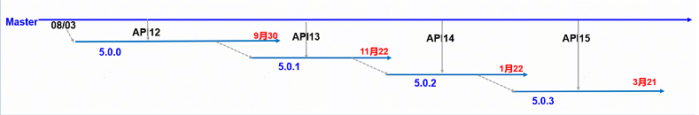

# **OpenHarmony 5.0.0 & 5.0.1 & 5.0.2 & 5.0.3版本维护策略公告**

尊敬的开发者，您好：

OpenHarmony 5.0项目在开发过程中，发布了多轮Release版本，分别支持不同的API level，其分支关系如下： 

考虑到减少OpenHarmony生态碎片化和维护版本投入成本，对5.0.X分支维护和兼容性测评策略进行优化，现公告如下：

1，5.0.0 & 5.0.1 & 5.0.2分支不主动规划维护版本和问题回合，仅做兼容性测评支持。

2，5.0.3分支按照1+1维护周期进行例行维护，并主动回合关键问题和安全漏洞，主动维护停止时间为2026年3月21日。

3，5.0.0 & 5.0.1 & 5.0.2版本兼容性测评周期与5.0.3版本一致，截止时间为2026年5月30日。

如有任何疑问，请联系分支Maintainer [@钟小明](https://gitee.com/shermanzhong)。

Release SIG 2025年9月10日

