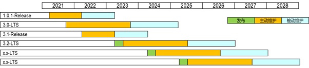

# OpenHarmony版本生命周期管理

OpenHarmony社区定期发布LTS/Release分支，并按照OpenHarmony生命周期管理策略提供维护和技术支持。

**Release**：Release分支是社区发布的稳定分支，该分支在经过集中编译、构建、集成测试并最终通过社区评审发布，发布后进入维护阶段。

**LTS**：LTS分支是在Release分支发布后，根据其使用范围和质量情况，经过社区评审变更为LTS（长期支持维护）分支，LTS分支维护生命周期长于Release分支。

#### 生命周期管理策略：

1，         Release分支生命周期为2年（1+1）。

2，         LTS分支生命周期为3.5年（2+1.5）。

3，         主动维护期：例行规划维护标签版本，合入缺陷修复、安全漏洞、以及其他必须的修改，并确保分支持续处于稳定可用状态。

4，         被动维护期：不再主动规划和发布标签版本，仅对社区严重以上的安全漏洞和缺陷进行修复。

5，         单个分支的生命周期结束前，将以邮件和公告的方式知会。