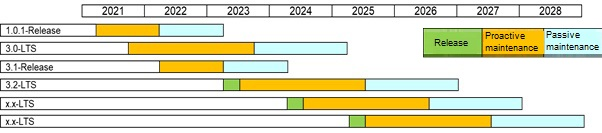

# OpenHarmony Version Lifecycle Management

The OpenHarmony community regularly releases LTS and Release branches and provides maintenance and technical support based on the OpenHarmony lifecycle management policy.

**Release**: A Release branch is a stable branch released in the community. A Release branch can be released only after centralized compilation, build, integration test, and review. Then it enters the maintenance phase.

**LTS**: A **Release** branch can be changed to a long-term support (LTS) branch after being approved by the community based on its application scope and quality. The maintenance lifecycle of an LTS branch is longer than that of a Release branch.

#### Lifecycle management policy

1. The lifecycle of a Release branch is two years (1+1).

2. The lifecycle of an LTS branch is 3.5 years (2 + 1.5).

3. Proactive maintenance period: During this period, the community routinely plans and maintains label versions, fixes defect and security vulnerabilities, incorporates other necessary modifications, and ensure that branches are stable and available.

4. Passive maintenance period: During this period, the community no longer plans or releases label versions. It only fixes major or higher security vulnerabilities and defects.

5. The end of the lifecycle of a branch will be made public by email and bulletin.
